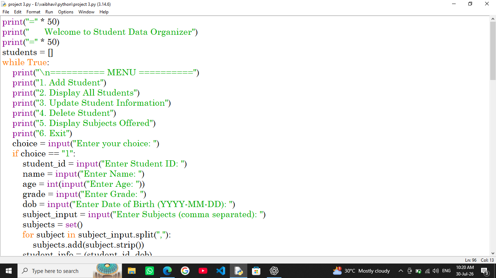
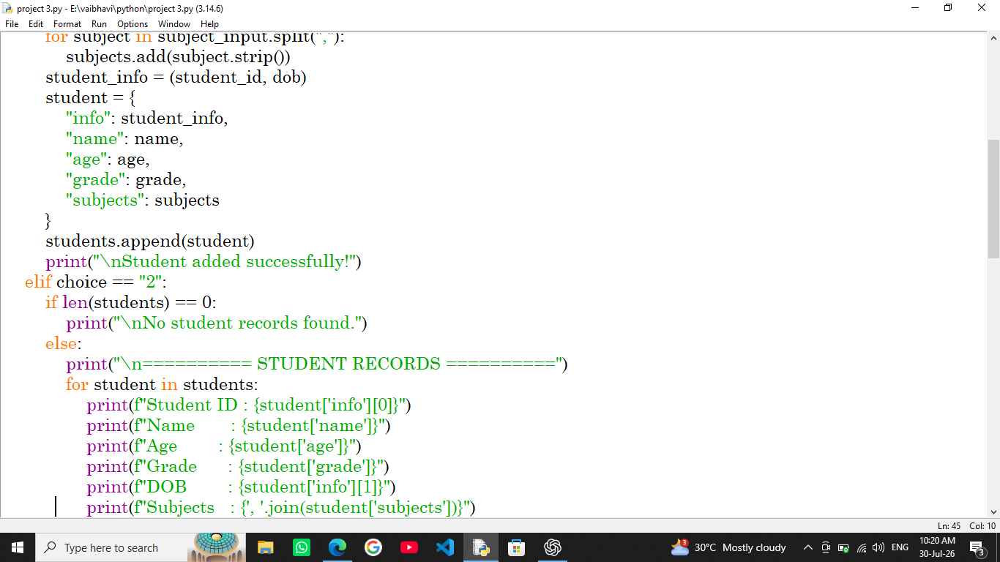
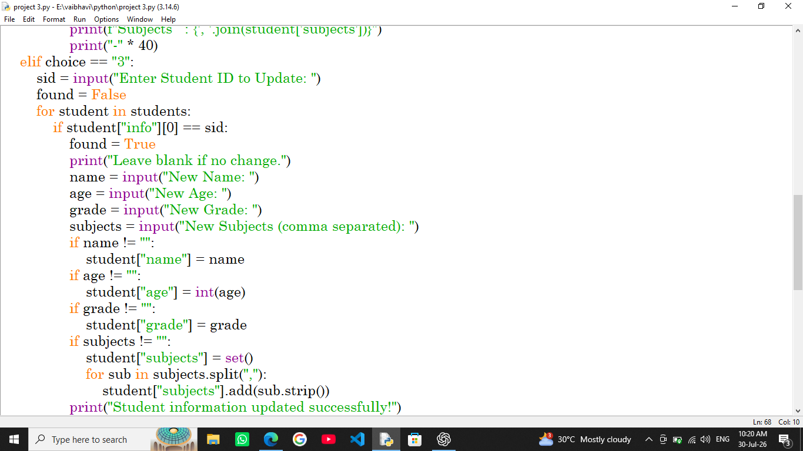
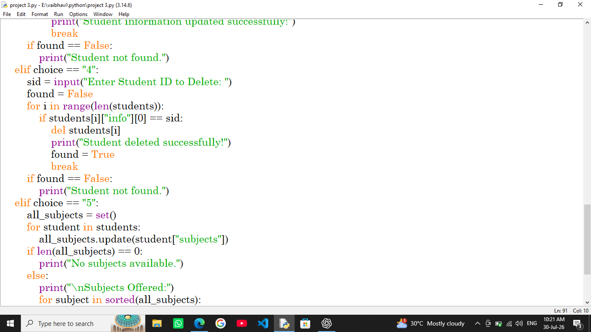
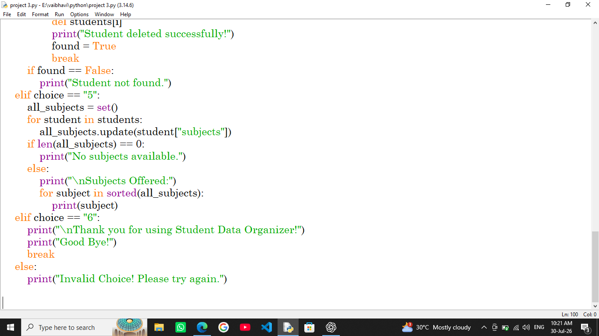

# 🎓 Student Data Organizer

A beginner-friendly **Python Console Application** that helps manage student records efficiently. This project allows users to add, update, display, and delete student information while also maintaining the list of subjects offered.

It is an excellent project for beginners to understand how **Python dictionaries, lists, loops, conditional statements, and CRUD (Create, Read, Update, Delete) operations**.

# 🎯 Project Objective

The main objective of this project is to learn and implement Python Collection concepts by managing student records using a **List of Dictionaries**. It demonstrates how CRUD operations can be performed efficiently in a menu-driven console application while following clean coding practices.

Users can:

- Add Student Records
- View All Students
- Update Student Information
- Delete Student Records
- Display Subjects Offered
- Exit the Program

The application stores data using a nested dictionary structure and demonstrates CRUD (Create, Read, Update, Delete) operations.

---

# ✨ Features

✅ Add Student

✅ Display All Students

✅ Update Student Information

✅ Delete Student

✅ Display All Subjects

✅ Prevent Duplicate Student IDs

✅ Clean Subject Formatting

✅ Menu-Driven Interface

---

# 🔄 Project Workflow

```text
                Start
                  │
                  ▼
      Welcome to Application
                  │
                  ▼
         Display Main Menu
                  │
      ┌───────────┼───────────┐
      │           │           │
      ▼           ▼           ▼
 Add Student  Display Data  Update Data
      │           │           │
      └───────────┼───────────┘
                  │
                  ▼
          Delete Student
                  │
                  ▼
       Display Subjects Offered
                  │
                  ▼
              Exit Program
```

---

# 🛠 Technologies Used

| Technology | Purpose |
|------------|---------|
| Python 3.x | Programming Language |
| VS Code | Code Editor |
| Terminal | Program Execution |

---

# 📂 Project Structure

```
Student-Data-Organizer/
│
├── project3.py
└── README.md
└── images
    -input1.png
    -input2.png
    -input3.png
    -input4.png
    -input5.png
```

```

```

---

# 🧠 Python Concepts Covered

- Variables
- Dictionaries
- Nested Dictionaries
- Lists
- Sets
- Loops
- Conditional Statements
- User Input
- CRUD Operations
- String Manipulation

---

# 🚀 How to Run

### Step 1

Install Python 3.x

### Step 2

Clone this repository

```bash
git clone https://github.com/vaibhavi743/collection-manipulator.git
```

### Step 3

Open Terminal

### Step 4

Run

```bash
python project3.py
```

---

# 📋 Menu Options

```
===== Student Data Organizer =====

1. Add Student
2. Display All Students
3. Update Student Information
4. Delete Student
5. Display Subjects Offered
6. Exit
```

---

# 💻 Sample Output

```text
Welcome to the Student Data Organizer!

===== Student Data Organizer =====

1. Add Student
2. Display All Students
3. Update Student Information
4. Delete Student
5. Display Subjects Offered
6. Exit

Enter your choice : 1

Student ID : 101

Name : Vaibhavi

Age : 20

Grade : BCA

Date of Birth : 2006-05-15

Subjects : Python, AI, Java

Student added successfully!
```

---

# 📸 Screenshot

Example:

```
images/

input1.png

input2.png

input3.png

input4.png

input5.png
```

```md
## Home Screen



## Add Student



## Display Students



## update students


#subject offered

```

---

# 📈 Future Improvements

- 💾 Save data permanently using File Handling
- 🔍 Search Student by ID
- 📊 Generate Student Report
- 📁 Export Data to CSV
- 🗄 SQLite Database
- 🖥 GUI using Tkinter
- 🌐 Web Version using Flask

---

# 🎯 Learning Outcomes

This project helped in understanding:

- Dictionary Operations
- CRUD Implementation
- Nested Data Structures
- Menu Driven Programs
- Python Collections
- Logical Problem Solving

---

# 👩‍💻 Author

### **Vaibhavi Khokhani**

🎓 BCA Student

💻 Python Developer (Beginner)

🤖 AI Learner

🌱 Always Learning New Technologies

---

# ⭐ Show Your Support

If you like this project,

⭐ Star this repository

Happy Coding! 🚀
